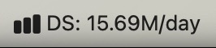
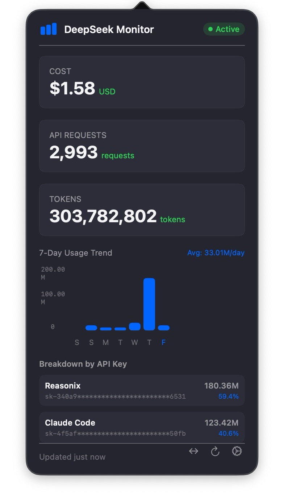
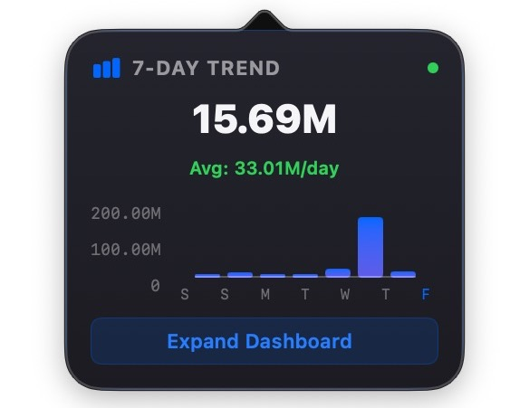
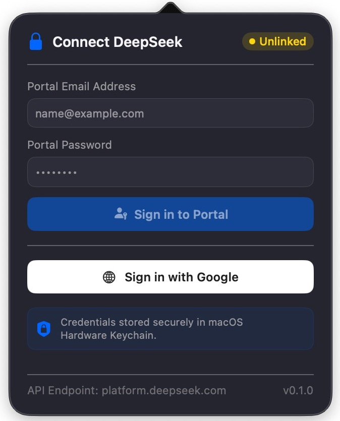

# DeepSeek Tray

A lightweight macOS menu-bar app that keeps an eye on your [DeepSeek](https://platform.deepseek.com) platform usage and cost — right from the menu bar.

 

## Features

- **Usage & cost monitoring** — daily token usage, API request counts, per-model 7-day charts, and monthly spend via the billing API (`/api/v0/usage/cost`)
- **Tray display modes** — today's tokens, monthly total, or estimated cost right in the menu bar label
- **Right-click tray menu** — Refresh Now, Open Dashboard, Open Mini Widget, Preferences…, Quit
- **Two sign-in options** — Portal Email & Password or Google SSO (standalone WKWebView window); the session JWT is stored in macOS Keychain
- **Automatic usage discovery** — the SSO sheet captures the platform's usage API (endpoint, headers); cost/tokens/charts populate from the replay, including monthly spend via the billing API (`/api/v0/usage/cost`)
- **Mini widget & charts** — compact popover widget and a 7-day stacked usage chart (per-model bars), both driven by the platform's daily-granularity data (last 7 days)
- **Dashboard ⇄ mini toggle** — sideways-arrow buttons in both corners: collapse the full dashboard to the mini widget (`→←`) and expand back (`←→`)
- **Sizes itself to content** — the popover resizes to each view's natural height (no blank space); Preferences/Dashboard open full-width even from the mini widget
- **Dark theme** — designed around a custom DS design system

## Requirements

- macOS 14.0+
- Swift 5.10 (Swift Package Manager)
- A DeepSeek platform account (portal credentials or Google SSO)

## Build & Run

```bash
swift build
swift run DeepSeekTray
```

Release build:

```bash
swift build -c release
```

## Install (no build required)

Grab the latest `DeepSeekTray-<version>.zip` from [Releases]https://github.com/Night-Vision/DeepSeek-Tray/releases), unzip, and drag `DeepSeekTray.app` to Applications.

> **Note (Gatekeeper):** the release build is ad-hoc signed (no Apple Developer ID, no sandbox), so macOS will block it the first time. Either:
> - Right-click `DeepSeekTray.app` → **Open** → **Open**, or
> - run `xattr -dr com.apple.quarantine "DeepSeekTray.app"` in the folder
>
> Then it launches normally from then on. Fully notarized builds need a $99/yr Apple Developer account.

## Screenshots






## Sign-in

Two ways to connect your account:

1. **Portal Email & Password** — sign in directly with your DeepSeek platform credentials in-app; background worker pre-fills and authenticates seamless session capture.
2. **Google SSO** — sign in with your Google account through a standalone WKWebView window; the window intercepts the platform's usage API traffic and captures auth headers automatically.


### How SSO works (exact flow)

1. Sign-in initializes a background or standalone WKWebView window.
2. A JS interceptor is injected at `documentStart` (all frames) that shadows `fetch`/`XMLHttpRequest` and forwards `url, method, status, headers` to Swift (request/response bodies are never read — auth rides in the headers).
3. You complete authentication on `platform.deepseek.com`.
4. **Auth is header-based**: the platform SPA sends a Bearer JWT per-request (`authorization` + `x-client-*` headers).
5. The SPA navigates to the Usage page and fires the usage API; the interceptor catches it and Swift validates the request: the URL matches the `/api/v0/usage/` schema (excluding cost/billing) with an `authorization` header present.
6. The sheet stores `ds_discovered_usage_endpoint` (`url`, `method`, `headers`, `discoveredAt` — never bodies) in UserDefaults, then **auto-closes**.
7. `UsageTracker.refresh()` replays that endpoint (relative URLs resolved against `https://platform.deepseek.com`, captured headers as auth); failures fall back to empty defaults.

Credentials live in the macOS Keychain under service `com.deepseek.tray` — never in plain files: the SSO Bearer JWT is stored under `googleToken` (restored at launch, so the session survives restarts). The captured usage endpoint config (URL + headers, never bodies) is stored in UserDefaults as `ds_discovered_usage_endpoint`.

## Security

- The SSO Bearer JWT is stored in the macOS Keychain (`kSecClassGenericPassword`, accessible after first unlock) under `googleToken` — restored at launch, so the session survives restarts
- No telemetry, no network calls beyond DeepSeek's own endpoints

## License

[MIT](LICENSE)

---

> **Note:** dashboard usage StatCards (requests, tokens, and API key breakdown) aggregate the rolling **last 7 days** to align with the 7-Day Usage Trend chart; monthly cost comes from the billing API `/api/v0/usage/cost` (the usage endpoint itself carries no dollar figures).
